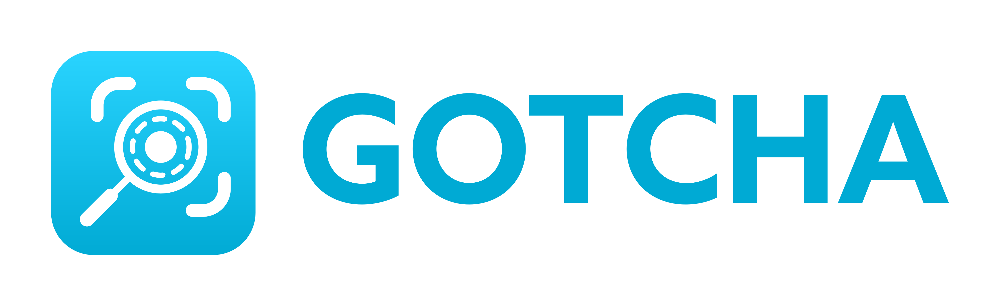

# **GOTCHA**

<h1 align=center>

</h1>

> **Table of contents**
>
> * [Description](#description)
>	* [Examples](#examples)
> * [Building and running](#building-and-running)

Description
---

Gotcha is an Android app that finds and extracts objects from pictures, allowing the user to export the resulting image as a png file. It uses OpenCV deep neural networks to distinguish objects and the GrabCut algorithm to extract objects accurately.

### Examples

\
\
\
\
\
\

Building and running
---

To run this you'll need to install the OpenCV Manager 3.4.3 app on your phone.

Minimum SDK: 21

To build this project you'll need the OpenCV-android-sdk folder (extracted from the [sdk zip](https://sourceforge.net/projects/opencvlibrary/files/opencv-android/3.4.3/opencv-3.4.3-android-sdk.zip/download)) in the root directory of the project. You can also modify the CMakeLists.txt file to use a different path.

### Android >10
---
Due to changes to the way Android allows access to external directories the weights download feature does not work properly on android versions above 10. I may fix this in the future but in the meanwhile this problem can be circumvented by downloading the files manually and copying them to Android/data/giorgioghisotti.unipr.it.gotcha/files/weights.

**WORK IN PROGRESS**
